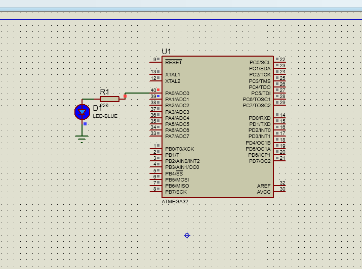

# ATmega32 DIO (GPIO) Driver

A modular MCAL DIO (GPIO) driver written in C for the ATmega32 microcontroller **MCAL (Microcontroller Abstraction Layer)** Digital Input/Output (DIO) Driver written in C for the **ATmega32** microcontroller. 

Designed following Layered Architecture principles for Embedded Systems to ensure code reusability, safety, and readability.

---

## 🛠️ Features & Highlights

* **Layered Architecture:** Clear separation between Application, MCAL, and Hardware layers.
* **Robust Error Handling:** Functions utilize `DIO_ErrorStatus` enum (`DIO_OK`, `DIO_NOK`) to handle invalid inputs safely.
* **NULL Pointer Checks:** Validates output pointers before dereferencing them.
* **Full Bitwise Control:** Comprehensive APIs for setting pin/port directions, setting pin/port states, reading values, and toggling pin states.

---

## 📁 Directory Structure

```text
├── MCAL/
│   └── DIO_1/
│       ├── DIO_configure.h     # Driver configurations
│       ├── DIO_interface.h     # Public APIs & type declarations
│       ├── DIO_private.h       # Register memory maps
│       └── DIO_programe.c      # API Implementations
├── LIB/
│   ├── BIT_MATH.h              # Bit-manipulation macros
│   └── STD_TYPES.h             # Standard type definitions (u8, etc.)
├── APPLICATIONS/
│   └── LED.c                   # Application test cases
├── Simulation/
│   └── LED_TEST.pdsprj         # Proteus simulation file  
├── Snapshots/
│   └── circuit_simulation.png  # Snapshot for simulation                      
└── README.md

```
## 🔌 API Overview

```c
/* Pin Control APIs */
DIO_ErrorStatus DIO_voidSetPinDirection  (U8 Copy_U8PORT , U8 Copy_U8PIN , U8 Copy_U8Direction);
DIO_ErrorStatus DIO_voidSetvalue         (U8 Copy_U8PORT , U8 Copy_U8PIN , U8 Copy_U8Value    );
DIO_ErrorStatus DIO_voidTogglePinValue   (U8 Copy_U8PORT , U8 Copy_U8PIN                      );
DIO_ErrorStatus DIO_GetValue             (U8 Copy_U8PORT , U8 Copy_U8PIN , U8* Copy_U8Value   );

/* Port Control APIs */
DIO_ErrorStatus DIO_voidSetPortDirection  (U8 Copy_U8PORT  , U8 Copy_U8Direction);
DIO_ErrorStatus DIO_voidSetPortValue      (U8 Copy_U8PORT   , U8 Copy_U8Value   );
DIO_ErrorStatus DIO_enumTogglePortValue   (U8 Copy_u8PORT                       );
DIO_ErrorStatus DIO_GetPortValue          (U8 Copy_U8PORT,U8* Copy_u8Value      );

```
### 💻 Tech Stack

Language: Embedded C

Target Controller: Microchip ATmega32

Toolchain: AVR-GCC / Eclipse IDE

## 📸 Simulation Preview


